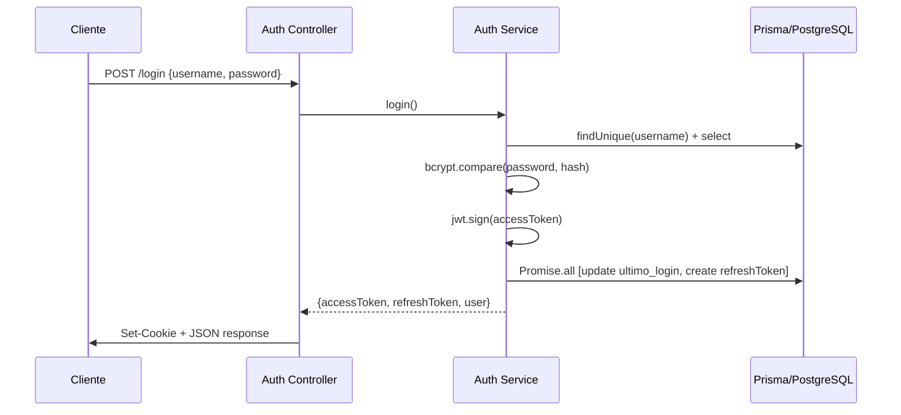
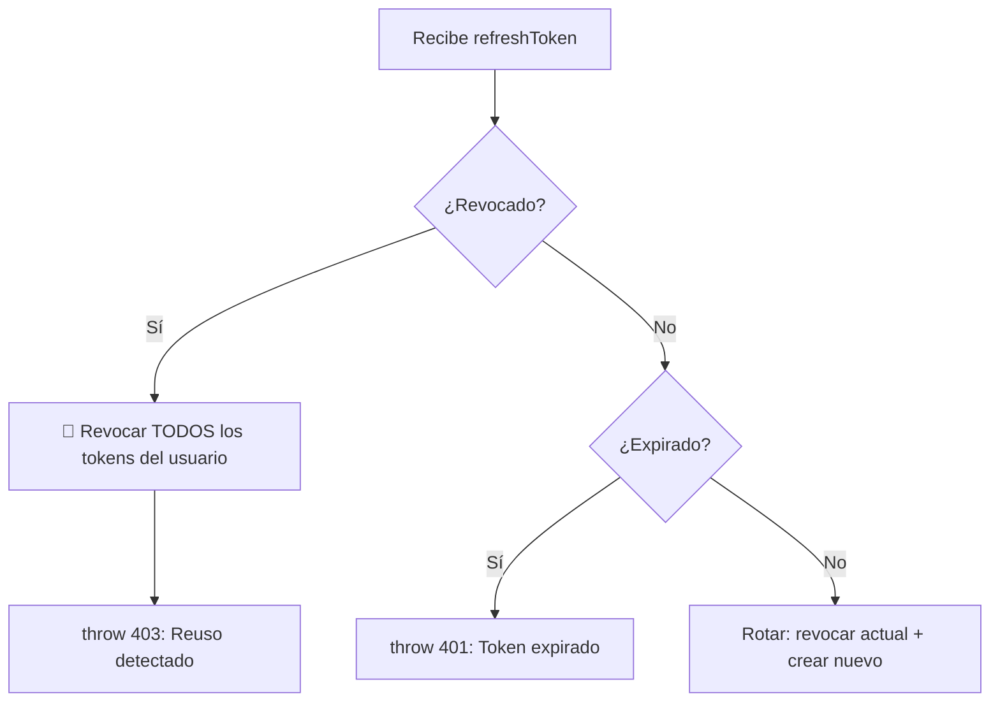

# Feature: Auth — Documentación Técnica

Autenticación y gestión de sesiones con JWT + Refresh Tokens. Incluye login, refresh con rotación de tokens, logout, revocación masiva de sesiones, recuperación de contraseña y completar email en primer login.

---

## Estructura de Archivos

```
src/features/auth/
├── auth.routes.js         # Endpoints (login, refresh, logout, password reset)
├── auth.controller.js     # Manejo Request/Response + helpers de cookies
├── auth.service.js        # Lógica de negocio + JWT + Prisma
├── auth.schema.js         # Schemas Zod (login, email, password)
├── logic/
│   └── auth.logic.js          # Helpers de negocio y criptografía pura dependientes del dominio
├── services/
│   └── token-cleanup.service.js # Cron de limpieza periódica de tokens expirados
└── utils/
    └── token.util.js          # Generación estéril de refresh tokens
```

---

## Modelo de Datos

```mermaid
erDiagram
    usuarios ||--|| credenciales_usuario : "auth"
    usuarios ||--o{ refresh_tokens : "sesiones"

    credenciales_usuario {
        int usuario_id PK_FK
        string hash_contrasena
        boolean bloqueado
        datetime ultimo_login
    }

    refresh_tokens {
        int id PK
        int usuario_id FK
        string token UK
        boolean revoked
        datetime expires_at
        datetime created_at
    }
```

---

## Endpoints

| Método | Ruta | Auth | Descripción |
|--------|------|------|-------------|
| `POST` | `/api/auth/login` | No | Login (rate-limited) |
| `POST` | `/api/auth/refresh` | No (cookie) | Renovar access token con refresh token |
| `POST` | `/api/auth/logout` | No (cookie) | Cerrar sesión actual |
| `GET` | `/api/auth/profile` | JWT | Obtener perfil completo |
| `POST` | `/api/auth/logout-all` | JWT | Revocar todas las sesiones |
| `POST` | `/api/auth/completar-email` | JWT | Actualizar email (primer login) |
| `POST` | `/api/auth/forgot-password` | No | Solicitar reset de contraseña |
| `POST` | `/api/auth/reset-password` | No | Resetear contraseña con token |

---

## Flujo de Autenticación



---

## Service — Funciones Clave

| Función | Lógica |
|---------|--------|
| `login` | Verifica credentials + genera JWT + refresh token. Updates en paralelo con `Promise.all` |
| `getProfile` | Perfil con datos condicionales por rol (alumno/coordinador/admin) |
| `refreshAccessToken` | Rotación de tokens: rota refresh token antiguo → crea nuevo. Detecta reuso malicioso |
| `logout` | Revoca refresh token específico (P2025 → 404) |
| `revokeAllTokens` | `updateMany` revoca todos los tokens activos del usuario |
| `forgotPassword` | Genera JWT temporal (1h) + envía email con Brevo |
| `resetPassword` | Verifica JWT temporal + actualiza hash + desbloquea cuenta |

### Seguridad: Detección de Token Reuse



---

## Controller — Helpers Privados

| Helper | Propósito |
|--------|-----------|
| `getRefreshTokenFromCookies(req)` | Extrae y valida refreshToken de `req.cookies` |
| `clearAuthCookies(res)` | Limpia `accessToken` y `refreshToken` de cookies |

---

## Cadena de Middlewares

| Ruta | Cadena |
|------|--------|
| `POST /login` | `loginLimiter` → `validate(loginSchema)` → controller |
| `POST /refresh` | → controller (lee cookie) |
| `POST /logout` | → controller (lee cookie) |
| `GET /profile` | `authenticate` → controller |
| `POST /logout-all` | `authenticate` → controller |
| `POST /completar-email` | `authenticate` → `validate` → controller |
| `POST /forgot-password` | `validate` → controller |
| `POST /reset-password` | `validate` → controller |
