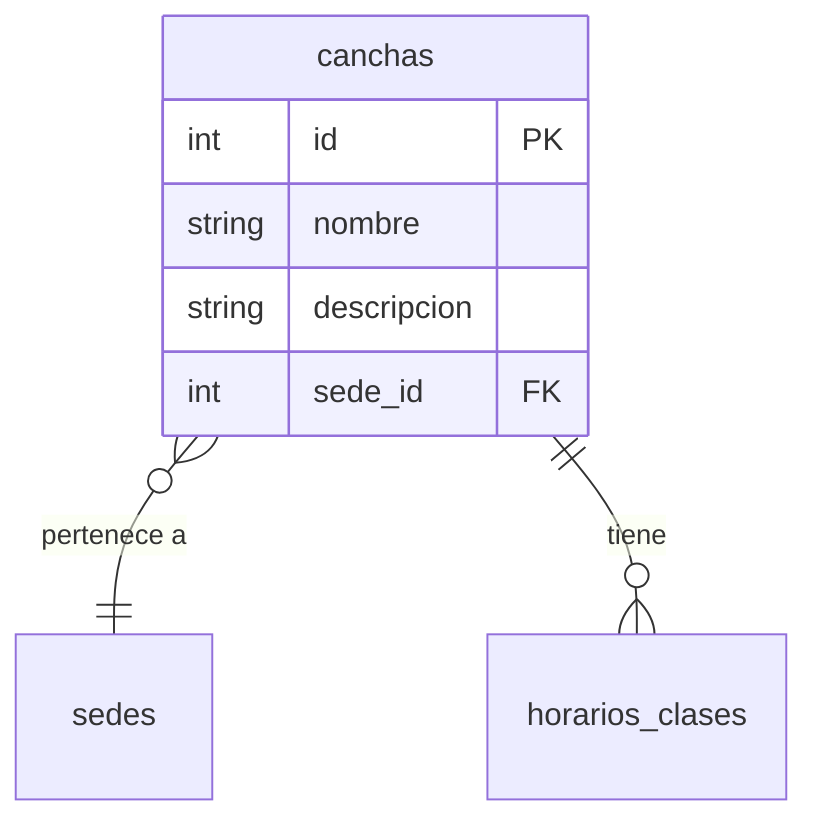

# Feature: Canchas — Documentación Técnica

CRUD de canchas de la academia. Cada cancha pertenece a una sede y puede tener horarios de clase asignados.

---

## Estructura de Archivos

```
src/features/canchas/
├── cancha.router.js      # Endpoints y middlewares (auth + validación)
├── cancha.controller.js  # Manejo Request/Response (catchAsync)
├── cancha.service.js     # Lógica de negocio + Prisma
└── cancha.schema.js      # Schemas Zod (create, update, idParam)
```

---

## Modelo de Datos



---

## Endpoints

| Método | Ruta | Auth | Descripción |
|--------|------|------|-------------|
| `GET` | `/api/canchas` | No | Listar todas las canchas con su sede |
| `GET` | `/api/canchas/:id` | No | Obtener cancha por ID |
| `POST` | `/api/canchas` | Admin | Crear cancha (valida que la sede exista) |
| `PUT` | `/api/canchas/:id` | Admin | Actualizar cancha |
| `DELETE` | `/api/canchas/:id` | Admin | Eliminar cancha (si no tiene horarios) |

---

## Archivo por Archivo

### 1. `cancha.schema.js` — Validación Zod

| Schema | Uso | Qué valida |
|--------|-----|-----------|
| `createSchema` | `POST /` body | `nombre` (3-100), `descripcion` (max 200, opcional), `sede_id` (coerce int+) |
| `updateSchema` | `PUT /:id` body | Todos opcionales, al menos 1 campo |
| `idParamSchema` | `GET/PUT/DELETE /:id` | Transforma `:id` string → int positivo |

### 2. `cancha.controller.js` — Capa HTTP (46 líneas)

- `create` → `apiResponse.created` (201)
- `delete` → `apiResponse.success` con mensaje
- Sin `parseInt`, sin `isNaN`, sin checks de null

### 3. `cancha.service.js` — Lógica de Negocio

| Función | Lógica clave |
|---------|-------------|
| `create` | Valida existencia de sede antes de crear |
| `getAll` | `findMany` con `CANCHA_SELECT` (incluye sede) |
| `getById` | `findUnique` + throw 404 |
| `update` | Verifica existencia de cancha Y sede (si cambió) |
| `delete` | **Protección de integridad:** usa `_count.horarios_clases` para prohibir eliminación si tiene horarios |

Todas las queries usan `select: CANCHA_SELECT` (§3.2).

### 4. `cancha.router.js` — Cadena de Middlewares

| Ruta | Cadena |
|------|--------|
| `GET /` | → controller (público) |
| `GET /:id` | `validateParams` → controller (público) |
| `POST /` | `authenticate` → `authorize('Administrador')` → `validate` → controller |
| `PUT /:id` | `authenticate` → `authorize` → `validateParams` → `validate` → controller |
| `DELETE /:id` | `authenticate` → `authorize` → `validateParams` → controller |
