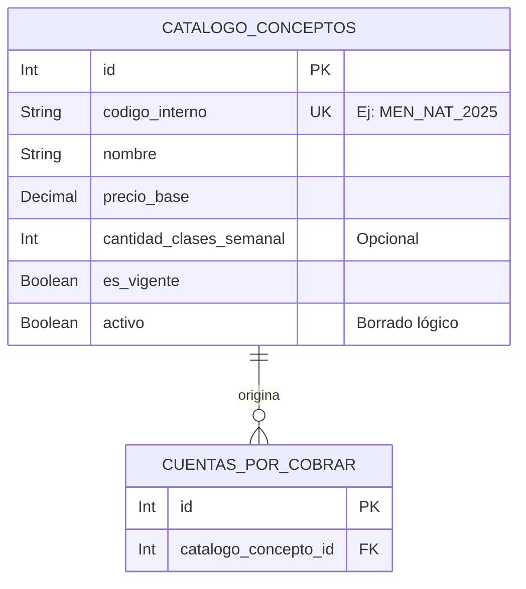

# Catálogo de Conceptos - Documentación Técnica (Antigravity 🚀)

## 1. Estructura de Archivos
Este feature gestiona el Catálogo Maestro de Conceptos (precios y rubros como Matrículas, Mensualidades u Otros). Los demás features dependen de estos códigos internos para generar cuentas por cobrar.
```text
src/features/catalogo_de_concepto/
├── catalogo.routes.js       # Rutas (GET, POST, PUT, DELETE) (Protegidas)
├── catalogo.controller.js   # Interacción HTTP mediante apiResponse (Objeto constante)
├── catalogo.service.js      # Lógica, conexión global Prisma y unicidad
└── catalogo.schema.js       # Validaciones Zod estandarizadas
```

## 2. Modelo de Datos


## 3. Endpoints

Todas las rutas están protegidas (`authenticate`).

| Método | Endpoint | Roles Permitidos | Zod Schema | Descripción |
|---|---|---|---|---|
| GET | `/` | Admin, Coordinador | *Ninguno* | Extrae todos los conceptos `activo: true` ordenados por nombre. |
| GET | `/:id` | Admin, Coordinador | `idParamSchema` | Extrae el detalle de un concepto catalogal por su ID Primario. |
| POST | `/` | Administrador | `createSchema` | Inserta un nuevo rubro catalogal asegurando que el `codigo_interno` sea único. |
| PUT | `/:id` | Administrador | `updateSchema`, `idParamSchema` | Actualiza propiedades de un rubro; valida unicidad cruzada si se cambia el código interno. |
| DELETE | `/:id` | Administrador | `idParamSchema` | Apaga el concepto (Borrado Lógico) desactivando `activo` y `es_vigente`. Evita romper Cuentas x Cobrar pasadas. |

## 4. Cadena de Middlewares

Ejemplo del flujo de creación segura (`POST /`):
1. `authenticate`: Protege de acceso no autorizado.
2. `authorize('Administrador')`: Solo dueños del negocio pueden dar de alta nuevos códigos.
3. `validate(catalogoSchema.createSchema)`: Protege el Payload parseando con coerciones (`z.coerce.number()`) los campos `precio_base` y `cantidad_clases_semanal` desde el Body.
4. `catalogoController.create`: Ejecutado limpio dentro del utilitario envolvente `catchAsync`.

## 5. Schemas Zod

| Schema | Propósito | Se usa en | Uso en Middleware |
|---|---|---|---|
| `createSchema` | Mapeo riguroso de longitudes para `nombre` y `codigo_interno`. Coerción numérica para el `precio_base` y manejo de nulidad segura en `cantidad_clases_semanal`. | `POST /` | `validate` |
| `updateSchema` | Reglas `.optional()` asegurándose al menos 1 llave enviada por Body (`refine`). | `PUT /:id` | `validate` |
| `idParamSchema` | Filtra el Params URL estandarizado transformándolo a Numérico Seguro O(1). | GET, PUT, DELETE | `validateParams` |

## 6. Lógica Core del Service

* **Singleton Global:** Se interconecta al pool principal central en `database.config.js` sin crear instancias sucias de `PrismaClient`.
* **Protección de Unicidad Cruzada:** En el método `update()`, discrimina si el usuario cambió el `codigo_interno`. De hacerlo, aplica un `findFirst({ where: { codigo_interno, id: { not: id } } })` para garantizar que no esté robando el código de otro concepto existente, abortando con `ApiError 400`.
* **Borrado Lógico (Soft Delete):** El `delete` nunca borra per-se; inactiva (`activo: false, es_vigente: false`) previniendo cascadas contra la tabla financiera (`cuentas_por_cobrar`).
