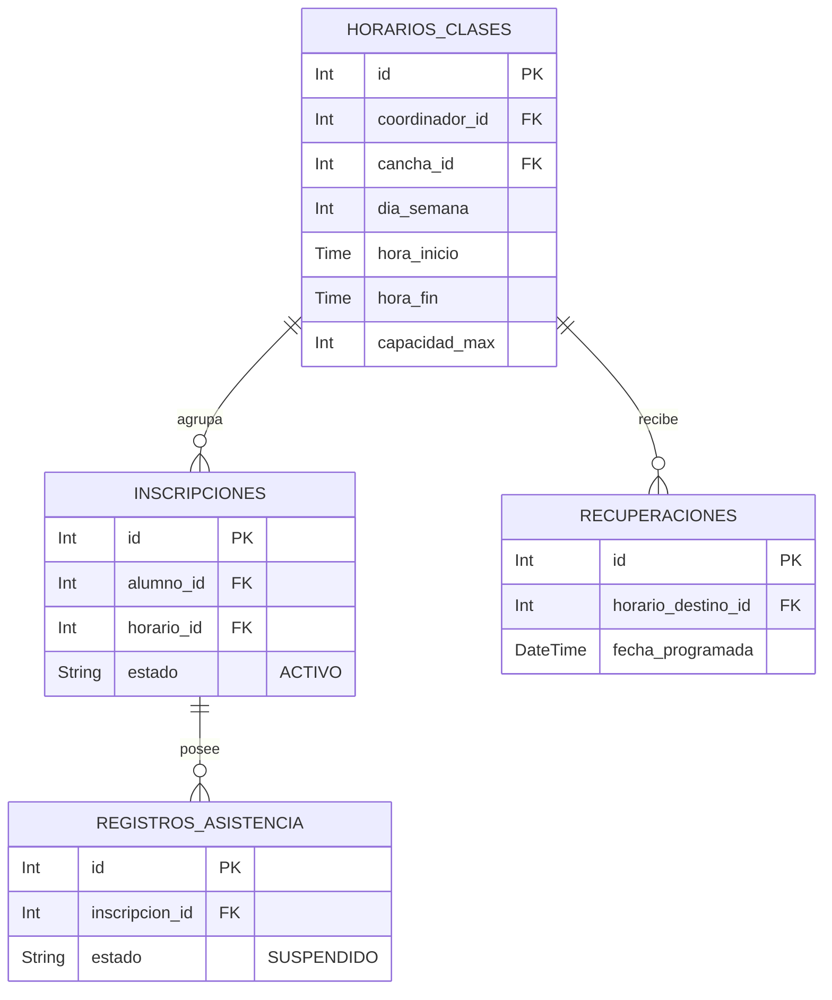

# Clases - Documentación Técnica (Antigravity 🚀)

## 1. Estructura de Archivos
Este feature gestiona el detalle y control de las clases, así como la reprogramación masiva por motivos institucionales.
```text
src/features/clases/
├── clase.routes.js       # Rutas (GET, POST)
├── clase.controller.js   # Interacción HTTP y apiResponse
├── clase.service.js      # Lógica pesada, reprogamaciones y cruce de datos
└── clase.schema.js       # Validaciones Zod (Body para reprogramación, Params para detalle)
```

## 2. Modelo de Datos


## 3. Endpoints

Todas las rutas requieren token (`authenticate`).

| Método | Endpoint | Roles Permitidos | Zod Schema | Descripción |
|---|---|---|---|---|
| POST | `/reprogramar-masivo` | Administrador | `reprogramarMasivoSchema` | Mueve una clase completa (y sus alumnos) de un horario/fecha a otro. |
| GET | `/:horario_id/detalle` | Admin, Coordinador | `horarioIdParamSchema` | Obtiene el detalle general de la clase y los alumnos inscritos activos. |

## 4. Cadena de Middlewares

Ejemplo del flujo de seguridad para `/:horario_id/detalle`:
1. `authenticate`: Verifica que el Token JWT sea válido.
2. `authorize('Administrador', 'Coordinador')`: Verifica permisos del empleado.
3. `validateParams(claseSchema.horarioIdParamSchema)`: Protege el parámetro para garantizar que la DB no colapse con IDs alfanuméricos falsos.
4. `claseController.obtenerDetalle`: Despacha la petición mediante `catchAsync`.

## 5. Schemas Zod

| Schema | Propósito | Se usa en | Uso en Middleware |
|---|---|---|---|
| `reprogramarMasivoSchema` | Valida que ambos IDs de horarios, ambas fechas y un motivo institucional estén presentes y en formato correcto (ISO 8601). | `/reprogramar-masivo` | `validate` |
| `horarioIdParamSchema` | Extrae el parámetro numérico de la URL previniendo errores de casteo en Prisma. | `/:horario_id/detalle` | `validateParams` |

## 6. Lógica Core del Service

El archivo `clase.service.js` delega interacciones delicadas a la BD. Está refactorizado bajo los lineamientos de **Clean Code (Regla §4.3)** de Gema Academy.

* **`reprogramarMasivamente:`** Transforma una reprogramación en una operación `BATCH` ACID. En vez de ser una función monolítica, está desglosada en las siguientes funciones puras y privadas para asegurar su mantenibilidad:
  1. `validarFechasYHorarios`: Verifica que los IDs existan y que la fecha de ingreso concuerde con el día del horario (Ej: Que no te agenden un Lunes en el Horario 5 que es solo para Viernes).
  2. `obtenerAlumnosAfectados`: Trae solo a los alumnos en estado `ACTIVO` del horario original.
  3. `detectarConflictosYClasificar`: Dentro de la transacción, separa a los alumnos en dos *buckets*: `paraProgramar` (vía libre) y `paraPendiente` (choque de horario).
  4. `procesarAsistenciasEnLote`: Marca automáticamente a todos los alumnos originales como `SUSPENDIDO` en esa fecha para justificar su inasistencia al profesor.
  5. `generarRecuperacionesEnLote`: Inserta de golpe (`createMany`) las compensaciones para los alumnos afectados.

* **`obtenerDetalleClase:`** Consulta pesada mitigada por Antigravity **Selects**. En vez de incluir todo el objeto `usuarios` y traérselo a memoria para 10-20 alumnos, usa una cascada de sentencias anidadas `select:` limitando el tráfico con la base de datos a `id, nombres, apellidos, email` y algunos campos base de `horarios_clases`, lo cual es estrictamente lo único que requiere el DTO de retorno.
