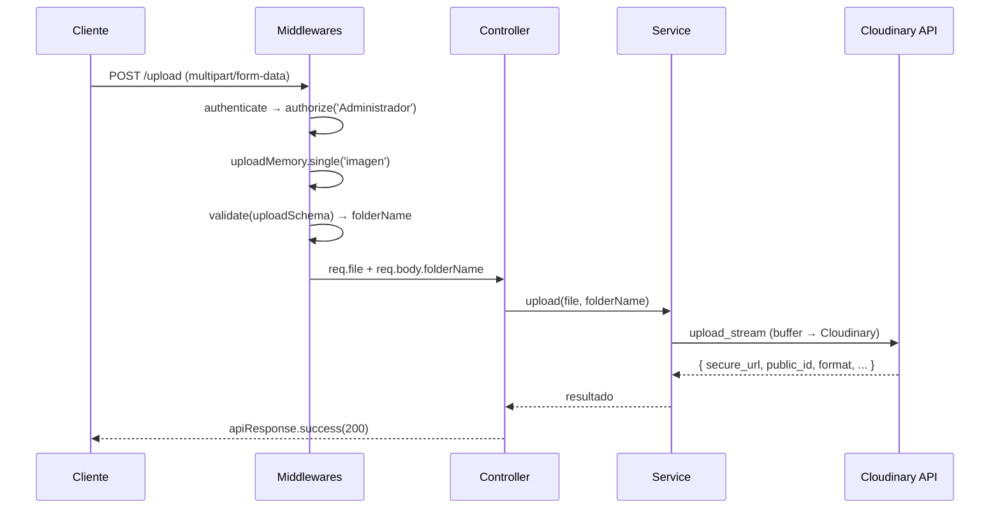

# Feature: CloudinaryImg — Documentación Técnica

Subida de imágenes a Cloudinary. Permite a administradores subir imágenes organizadas por carpetas.

---

## Estructura de Archivos

```text
src/features/cloudinaryImg/
├── cloudinary.routes.js       # Endpoints y middlewares
├── cloudinary.controller.js   # Manejo Request/Response (catchAsync)
├── cloudinary.service.js      # Lógica de subida a Cloudinary
└── cloudinary.schema.js       # Schema Zod (folderName)
```

Config asociado: `src/config/cloudinary.config.js` (inicializa SDK y exporta instancia).

---

## Endpoints

| Método | Ruta | Auth | Descripción |
|--------|------|------|-------------|
| `POST` | `/api/cloudinary/upload` | `Administrador` | Subir imagen a Cloudinary |

**Body:** `multipart/form-data` con campo `imagen` (file) y `folderName` (string).

---

## Flujo de Datos



---

## Schema Zod (`cloudinary.schema.js`)

| Schema | Uso | Qué valida |
|--------|-----|------------|
| `uploadSchema` | `POST /upload` | `folderName`: string, 1-100 chars, requerido |

---

## Cadena de Middlewares

| Ruta | Cadena |
|------|--------|
| `POST /upload` | `authenticate` → `authorize('Administrador', 'Alumno')` → `uploadMemory.single('imagen')` → `validate(uploadSchema)` → controller |
