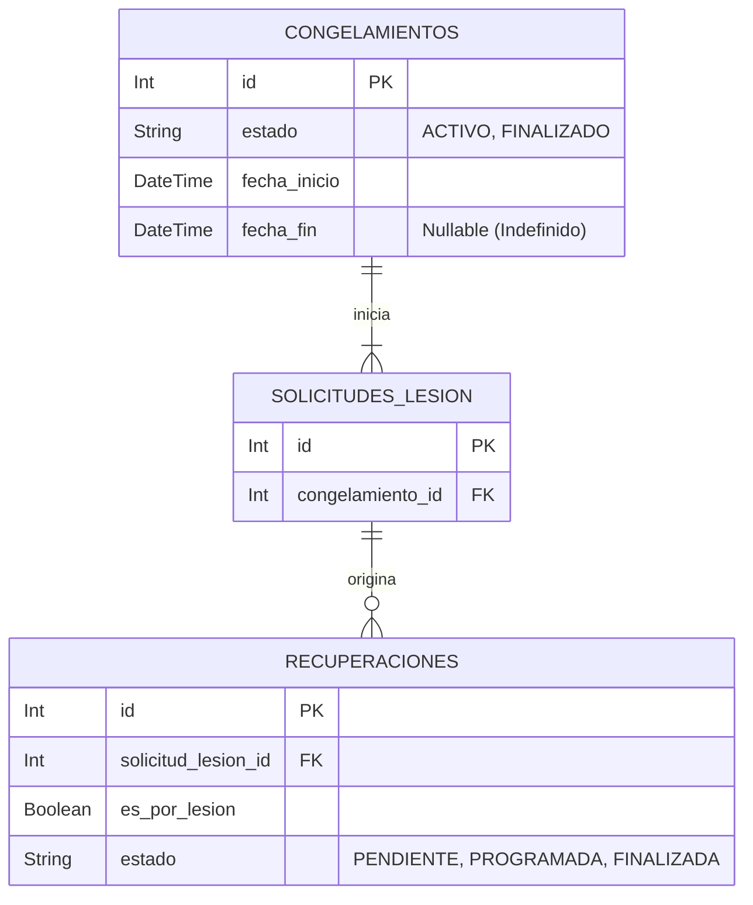

# Congelamientos - Documentación Técnica (Antigravity 🚀)

## 1. Estructura de Archivos
Este es un *feature sin interfaz de usuario directa*. Actúa como un motor de fondo que regula los procesos automatizados y cron jobs pertenecientes estrictamente a los congelamientos de cuentas.
```text
src/features/congelamientos/
├── congelamiento-cron.service.js    # Tareas automatizadas invocadas por el Job Scheduler
```

## 2. Modelo de Datos


## 3. Endpoints

*Ninguno.* Este feature no expone rutas HTTP dentro de `app.js`.

## 4. Lógica Core del Service

El único script disponible (`congelamientoCronService`) contiene un único bloque `gestionarCongelamientos()` el cual divide su revisión puramente optimizada (`batch execution`) en dos fases al amanecer.

**Fase 1: Intervención por Rango**
Todos aquellos congelamientos cuya `fecha_fin` estricta haya sido superada por la `fecha_hoy`, se marcan instantáneamente a `FINALIZADO`. Requiere costo O(1) vía subquery de Prisma.

**Fase 2: Intervención por Altas Médicas (Indefinidos)**
Todos los congelamientos cuya `fecha_fin` sea `null` (como fracturas de hueso), usan un *Join* condicional avanzado a través del engine relacional de Prisma.
El algoritmo verifica si la **Solicitud de Lesión madre** contiene alguna Recuperación amarrada que aún esté `PENDIENTE` o `PROGRAMADA`. Un simple uso del prisma flag `{ none: { estado: { in: [...] } } }`. Si ninguna de sus recuperaciones médicas sigue activa, asume que el alumno volvió definitivamente al curso y da de baja automática (`FINALIZADO`) al congelamiento.

## 5. Rendimiento
Al no usar `findMany()` sino solo `updateMany()` que inyecta la lógica condicional en la propia consulta original de PostgreSQL, previenen _Race Conditions_ y ejecutan la limpieza de miles de registros en mili-segundos.
