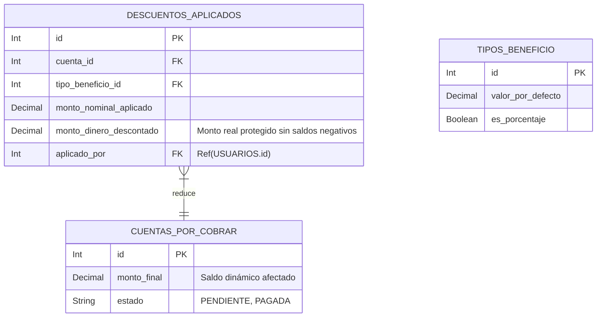

# Descuentos Aplicados - Documentación Técnica (Antigravity 🚀)

## 1. Estructura de Archivos
Este feature gestiona el registro histórico de las rebajas o becas que se aplican a los recibos de pago. Contiene lógica pesada sobre `Cuentas_por_Cobrar`.
```text
src/features/descuentos_aplicados/
├── descuentos_aplicados.routes.js       # Rutas (GET, POST, DELETE) Protegidas estrictamente
├── descuentos_aplicados.controller.js   # Interacción HTTP ligera e inyección segura por JWT
├── descuentos_aplicados.service.js      # Pool Prisma, Transacciones Financieras Atómicas
└── descuentos_aplicados.schema.js       # Validaciones Zod, Coerciones estrictas pre-service
```

## 2. Modelo de Datos


## 3. Endpoints

Todas las rutas están protegidas globalmente por el middleware `authenticate`.

| Método | Endpoint | Roles Permitidos | Zod Schema | Descripción |
|---|---|---|---|---|
| POST | `/aplicar` | Administrador | `aplicarSchema` | Rebaja el precio de una cuenta. Consume `req.user.id` en vez del viejo admin_id de body por seguridad imperativa. |
| GET | `/cuenta/:cuentaId` | Admin, Coordinador | `cuentaIdParamSchema` | Devuelve `findMany()` poblando al `Administrador` que causó el efecto. |
| DELETE | `/:id` | Administrador | `descuentoIdParamSchema`, `eliminarQuerySchema` | Reversión Atómica. Suma de vuelta la deuda descontada a la cuenta, repasa el estado del recibo y borra el historial del descuento.  |

## 4. Cadena de Middlewares y Extracción Segura

Ejemplo de flujo Seguro Transaccional (`POST /aplicar`):
Los requests son sanitizados primero. En vez de esperar un `admin_id` desde el Body (donde un hacker podría inyectar el ID de *otra* persona), el controlador lo saca del JWT Server Side (`req.user.id`).
La data llega al `DescuentoAplicadoService`.

## 5. Prevención de Riesgos Lógicos

* **Antigravity Rule de Restricción:** `yaTieneEseBeneficio`. Si un usuario hace doble tap rápido en el Frontend, el servicio previene duplicaciones comprobando el array en memoria si ese beneficio específico ya reside en el carrito de la cuenta por cobrar.
* **Transacciones Financieras:** Se usa `prisma.$transaction`. Si la inserción del Descuento ocurre con éxito, pero la actualización del Monto Final del recibo se corta por red, ambas consultas se deshacen asegurando paridad contable en la academia.
* **Auto Cierre Inteligente:** Si el Descuentazo supera la deuda original, se auto-ajusta para nunca generar número negativo. Si el saldo resultante tras el descuento es `$0.00`, la cuenta por cobrar permuta su prop a `estado: 'PAGADA'` automáticamente.
