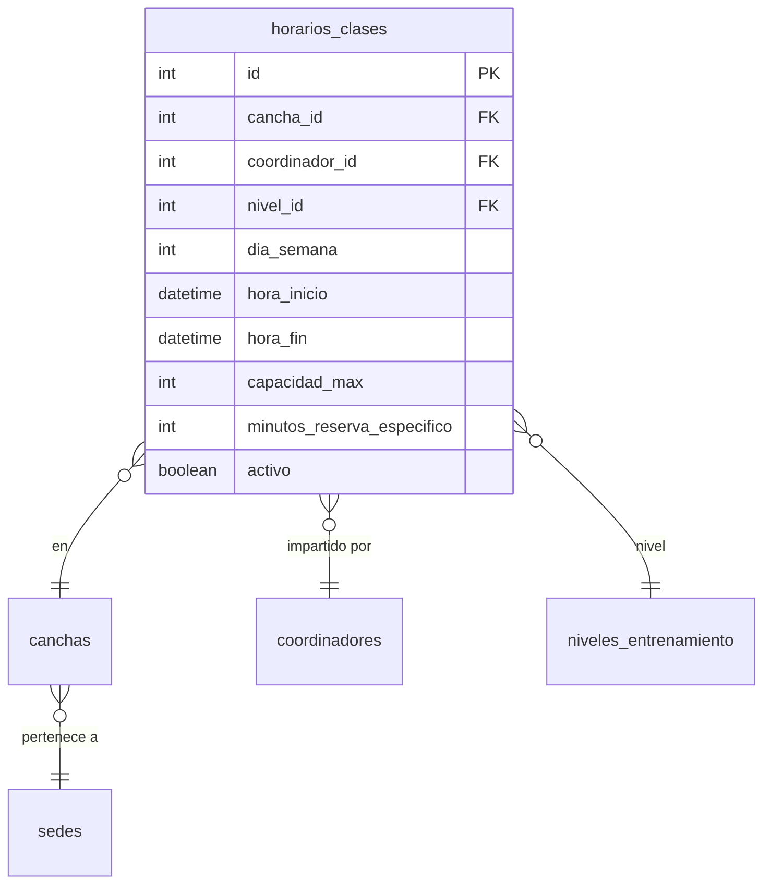
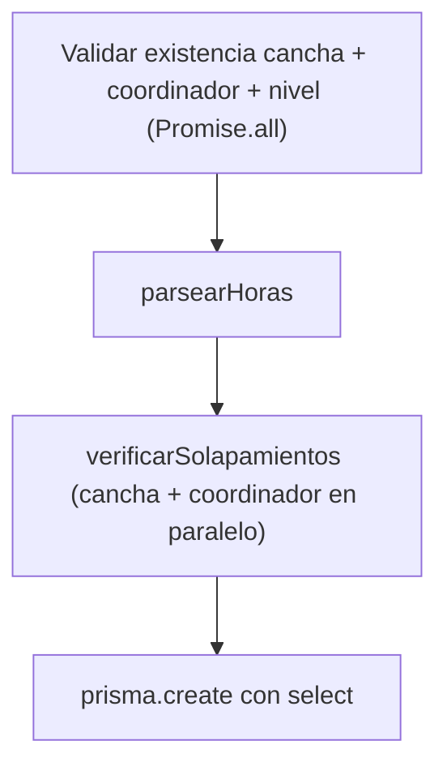

# Feature: Horarios — Documentación Técnica

Gestión de horarios de clases de la academia. Permite crear, actualizar y desactivar franjas horarias asignadas a canchas, coordinadores y niveles de entrenamiento. Incluye validación de solapamientos.

---

## Estructura de Archivos

```
src/features/horarios/
├── horario.routes.js      # Endpoints y middlewares (auth + validación)
├── horario.controller.js  # Manejo de Request/Response con catchAsync
├── horario.service.js     # Lógica de negocio: solapamientos, CRUD
├── horario.schema.js      # Schemas Zod (create, update, idParam)
└── HORARIOS.md            # Esta documentación
```

---

## Modelo de Datos



---

## Endpoints

| Método | Ruta | Auth | Descripción |
|--------|------|------|-------------|
| `GET` | `/api/horarios` | No | Listar todos los horarios con cancha, sede, coordinador y nivel |
| `POST` | `/api/horarios` | Admin/Coord | Crear horario (valida solapamientos) |
| `PUT` | `/api/horarios/:id` | Admin/Coord | Actualizar horario (update parcial + solapamientos) |
| `DELETE` | `/api/horarios/:id` | Admin | Soft delete (activo → false) |

---

## Archivo por Archivo

### 1. `horario.schema.js` — Validación Zod

| Schema | Uso | Qué valida |
|--------|-----|-----------|
| `createHorarioSchema` | `POST /` body | `cancha_id`, `coordinador_id`, `nivel_id` (coerce int+), `dia_semana` (1-7), `hora_inicio`/`hora_fin` (HH:MM), `capacidad_max` (default 20) |
| `updateHorarioSchema` | `PUT /:id` body | Todos opcionales + `activo` (bool). Al menos 1 campo requerido |
| `idParamSchema` | `PUT/DELETE /:id` params | Transforma `:id` string → int positivo |

**Patrón `z.coerce.number()`:** simplifica la aceptación de valores que pueden llegar como string o number del JSON.

---

### 2. `horario.controller.js` — Capa HTTP (35 líneas)

Cada handler sigue el patrón limpio §4.1:

```javascript
handler: catchAsync(async (req, res) => {
  const data = await horarioService.metodo(req.params.id, req.body);
  return apiResponse.success(res, { message: '...', data });
})
```

- `apiResponse.created` (201) para `createHorario`
- `apiResponse.noContent` (204) para `deleteHorario`
- Sin `try/catch`, sin manejo de P2002 (el service lanza `ApiError`)

---

### 3. `horario.service.js` — Lógica de Negocio

#### Helpers Privados

| Helper | Líneas | Propósito |
|--------|--------|-----------|
| `HORARIO_SELECT` | Constante | Select explícito con canchas→sedes, coordinadores→usuarios, niveles |
| `parsearHoras()` | ~10 | Convierte `"HH:MM"` → `Date`, valida que fin > inicio |
| `buildSolapamientoWhere()` | ~12 | Construye el `where` para detectar solapamientos (3 condiciones OR) |
| `verificarSolapamientos()` | ~20 | Ejecuta solapamiento de cancha + coordinador **en paralelo** (`Promise.all`) |
| `formatearHorario()` | ~20 | Transforma resultado Prisma al formato de la API |

#### `createHorario()` — Flujo



#### `updateHorario()` — Update parcial inteligente

1. Busca el horario existente con todos sus campos
2. **Merge**: para cada campo, usa el valor nuevo si viene, si no conserva el existente
3. Solo valida existencia de entidades que **cambiaron** (evita queries innecesarios)
4. Solo verifica solapamientos si el horario estará **activo**

#### `deleteHorario()` — Soft delete

No elimina el registro, solo cambia `activo: false`. Esto preserva la integridad referencial con inscripciones y clases históricas.

#### Lógica de Solapamiento

Tres condiciones detectan si dos horarios se solapan:

```
Caso 1: |--existente--|        → nuevo inicio cae DENTRO del existente
             |--nuevo--|

Caso 2:      |--existente--|   → nuevo fin cae DENTRO del existente
        |--nuevo--|

Caso 3:      |--ex--|          → nuevo CONTIENE al existente
        |----nuevo----|
```

Se verifican dos solapamientos independientes:
- **Por cancha**: no puede haber dos clases en la misma cancha al mismo tiempo
- **Por coordinador**: un coordinador no puede estar en dos sitios a la vez

---

### 4. `horario.routes.js` — Cadena de Middlewares

| Ruta | Cadena |
|------|--------|
| `GET /` | → controller (público) |
| `POST /` | `authenticate` → `authorize('Administrador', 'Coordinador')` → `validate` → controller |
| `PUT /:id` | `authenticate` → `authorize` → `validateParams` → `validate` → controller |
| `DELETE /:id` | `authenticate` → `authorize('Administrador')` → `validateParams` → controller |

> El `GET` es público para que la app muestre horarios disponibles. Crear y modificar requiere ser Admin o Coordinador. Solo Admin puede eliminar (soft delete).
