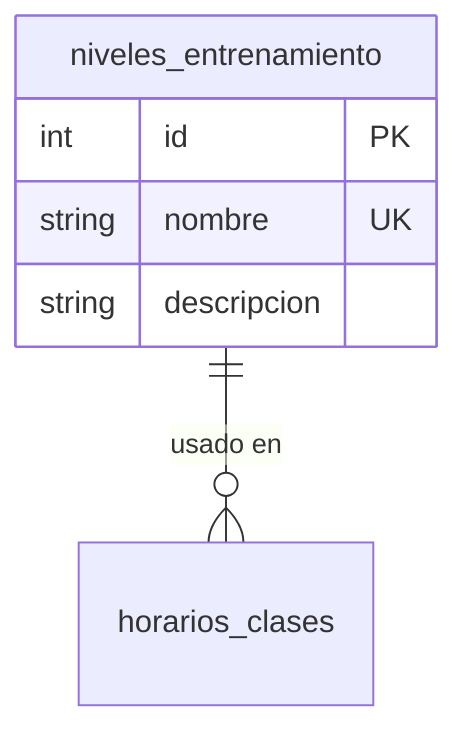

# Feature: Niveles — Documentación Técnica

Gestión del catálogo de niveles de entrenamiento (ej: Principiante, Intermedio, Avanzado). Usado por el feature de horarios para asignar un nivel a cada clase.

---

## Estructura de Archivos

```
src/features/niveles/
├── niveles.routes.js      # Endpoints y middlewares (auth + validación)
├── niveles.controller.js  # Manejo de Request/Response con catchAsync
├── niveles.service.js     # Lógica de negocio + Prisma
└── niveles.schema.js      # Schemas Zod (create, update, idParam)
```

---

## Modelo de Datos



---

## Endpoints

| Método | Ruta | Auth | Descripción |
|--------|------|------|-------------|
| `GET` | `/api/niveles` | No | Listar todos los niveles |
| `POST` | `/api/niveles` | Admin | Crear nuevo nivel |
| `PUT` | `/api/niveles/:id` | Admin | Actualizar nivel |
| `DELETE` | `/api/niveles/:id` | Admin | Eliminar nivel (si no tiene horarios) |

---

## Archivo por Archivo

### 1. `niveles.schema.js` — Validación Zod

| Schema | Uso | Qué valida |
|--------|-----|-----------|
| `createNivelSchema` | `POST /` body | `nombre` (3-50, requerido), `descripcion` (max 200, opcional) |
| `updateNivelSchema` | `PUT /:id` body | Ambos opcionales, al menos 1 campo |
| `idParamSchema` | `PUT/DELETE /:id` params | Transforma `:id` string → int positivo |

### 2. `niveles.controller.js` — Capa HTTP

Patrón limpio §4.1 — cada handler: `service.metodo()` → `apiResponse`:
- `createNivel` → `apiResponse.created` (201)
- `deleteNivel` → `apiResponse.success` sin data
- Sin `try/catch`, sin checks duplicados

### 3. `niveles.service.js` — Lógica de Negocio

| Función | Lógica clave |
|---------|-------------|
| `createNivel` | Verifica unicidad case-insensitive antes de crear |
| `getAllNiveles` | Retorna `[]` si no hay niveles (no 404) |
| `updateNivel` | Verifica existencia, luego actualiza |
| `deleteNivel` | Un solo query con `_count.horarios_clases` — bloquea eliminación si hay horarios asociados |

Todas las queries usan `select: NIVEL_SELECT` (§3.2).

### 4. `niveles.routes.js` — Cadena de Middlewares

| Ruta | Cadena |
|------|--------|
| `GET /` | → controller (público) |
| `POST /` | `authenticate` → `authorize('Administrador')` → `validate` → controller |
| `PUT /:id` | `authenticate` → `authorize` → `validateParams` → `validate` → controller |
| `DELETE /:id` | `authenticate` → `authorize` → `validateParams` → controller |
