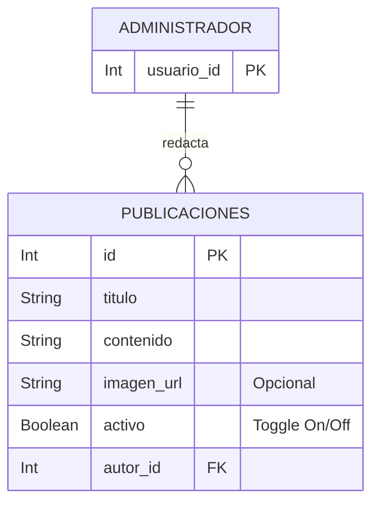

# Publicaciones - Documentación Técnica (Antigravity 🚀)

## 1. Estructura de Archivos
Este feature maneja el CRUD completo de publicaciones/noticias, incluyendo la carga opcional de imágenes hacia Cloudinary, con sus respectivos controles de estado y filtros públicos.
```text
src/features/publicaciones/
├── publicacion.routes.js       # Rutas (GET, POST, PUT, PATCH, DELETE)
├── publicacion.controller.js   # Interacción HTTP y apiResponse
├── publicacion.service.js      # Lógica pesada, interacción con Prisma y Cloudinary
└── publicacion.schema.js       # Validaciones Zod estandarizadas
```

## 2. Modelo de Datos


## 3. Endpoints

| Método | Endpoint | Roles Permitidos | Zod Schema | Multipart | Descripción |
|---|---|---|---|---|---|
| GET | `/` | Público | `querySchema` | No | Lista todas las publicaciones (paginadas) permitiendo filtro por `activo` y `titulo`. |
| GET | `/:id` | Público | `idParamSchema` | No | Obtiene los detalles de una publicación base por ID. |
| POST | `/` | Administrador | `createSchema` | Sí (`uploadMemory`) | Crea una noticia nueva vinculándola al administrador en sesión. |
| PUT | `/:id` | Administrador | `updateSchema` | Sí (`uploadMemory`) | Actualiza contenido o reemplaza la imagen existente de una publicación. |
| PATCH | `/:id/desactivar` | Administrador | `idParamSchema` | No | Apaga una publicación sin borrarla de la BD. |
| PATCH | `/:id/activar` | Administrador | `idParamSchema` | No | Enciende una publicación desactivada previamente. |
| DELETE | `/:id` | Administrador | `idParamSchema` | No | Borrado físico `delete` definitivo del registro. |

## 4. Cadena de Middlewares

Ejemplo del flujo de creación segura (`POST /`):
1. `authenticate`: Verifica token JWT e inyecta `req.user`.
2. `authorize('Administrador')`: Verifica rol contra base de datos.
3. `uploadMemory.single('imagen')`: Intercepta *form-data* y guarda en memoria temporalmente.
4. `validate(publicacionSchema.createSchema)`: Asegura que el `titulo` y `contenido` existen y excedan la longitud requerida.
5. `publicacionController.createPublicacion`: Ejecuta.

## 5. Schemas Zod

| Schema | Propósito | Se usa en |
|---|---|---|
| `createSchema` | Validación estricta con `.min(x)` y `.max(x)` garantizando inputs limpias. | `POST /` |
| `updateSchema` | Uso avanzado de `z.preprocess` para convertir strings de *FormData* ('true' / 'false') en `Boolean`. Campos opcionales. | `PUT /:id` |
| `idParamSchema` | Regex estricto de casteo entero positivo. | GET, PUT, PATCH, DELETE |
| `querySchema` | Estructuras por defecto `limit = 10` y paginación obligatoria limpia que evita desbordes SQL. | `GET /` |

## 6. Lógica Core del Service

El archivo `publicacion.service.js` cumple un papel brillante respetando performance base.
* **`getAllPublicaciones:`** Obtener de la base de datos la paginación requiere el _Data_ y el _Count_. Para **No bloquear** el Node Event Loop, utiliza `await Promise.all()` procesando ambos queries en la base de PostgreSQL al unísono reduciendo latencia.
* **`subirImagen:`** Una abstracción minimalista auxiliar local que si el `fileObject` de *multer memory* existe, lo empuja directamente usando el Shared Service (`cloudinaryService`).
* **Regla Lean Data:** Constantemente se reutiliza el objeto constante relacional `PUBLICACION_SELECT` que limpia hashes y previene escapes de memoria enviando lo mínimo vital al frontend.
