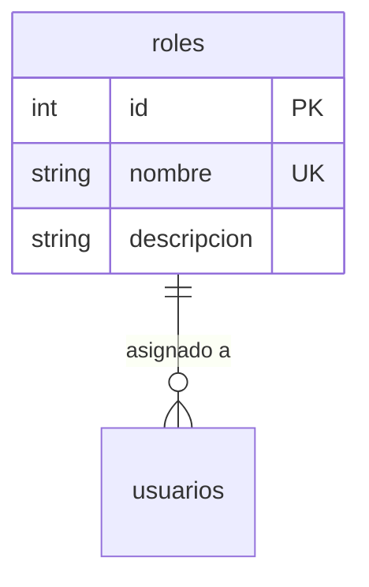
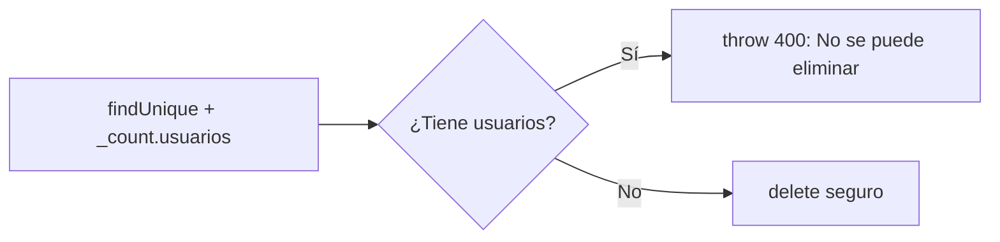

# Feature: Roles — Documentación Técnica

Gestión del catálogo de roles del sistema (Alumno, Coordinador, Administrador). Controla quién puede hacer qué dentro de la academia.

---

## Estructura de Archivos

```
src/features/roles/
├── roles.routes.js      # Endpoints y middlewares
├── roles.controller.js  # Manejo de Request/Response
├── roles.service.js     # Lógica de negocio + Prisma
├── roles.schema.js      # Schemas Zod para validación
└── roles.constants.js   # Constantes compartidas (roles válidos, campos requeridos)
```

---

## Modelo de Datos



Los roles son un catálogo finito. Cada usuario tiene exactamente un `rol_id` que referencia esta tabla.

---

## Endpoints

| Método | Ruta | Auth | Descripción |
|--------|------|------|-------------|
| `GET` | `/api/roles` | No | Listar todos los roles |
| `GET` | `/api/roles/:id` | No | Obtener rol por ID |
| `GET` | `/api/roles/nombre/:nombre` | No | Obtener rol por nombre |
| `POST` | `/api/roles` | Admin | Crear nuevo rol |
| `PUT` | `/api/roles/:id` | Admin | Actualizar descripción del rol |
| `DELETE` | `/api/roles/:id` | Admin | Eliminar rol (si no tiene usuarios) |

---

## Archivo por Archivo

### 1. `roles.schema.js` — Validación Zod

| Schema | Middleware | Qué valida |
|--------|-----------|-----------|
| `crearRolSchema` | `validate` (body) | `nombre` (3-50 chars), `descripcion` (max 200, opcional) |
| `actualizarRolSchema` | `validate` (body) | `descripcion` opcional, pero al menos 1 campo |
| `idParamSchema` | `validateParams` | Transforma `:id` string → int positivo |
| `nombreParamSchema` | `validateParams` | `:nombre` string (2-50 chars) |

---

### 2. `roles.controller.js` — Capa HTTP

Todos los handlers siguen el patrón limpio §4.1:

```javascript
handler: catchAsync(async (req, res) => {
  const data = await rolesService.metodo(req.params.id);
  return apiResponse.success(res, { message: '...', data });
})
```

- **Sin `try/catch`** — `catchAsync` lo maneja
- **Sin validación manual** — Zod lo hizo en el middleware
- **Sin `parseInt`** — Zod transformó `params.id` a `number`
- **`apiResponse.created`** (201) para `createRole`

---

### 3. `roles.service.js` — Lógica de Negocio

#### Constante de Select

```javascript
const ROLES_SELECT = { id: true, nombre: true, descripcion: true };
```

Todas las queries usan `select: ROLES_SELECT` (§3.2 Prisma Selectivo).

#### Funciones

| Función | Lógica clave |
|---------|-------------|
| `createRole` | Normaliza nombre (primera letra mayúscula). Verifica unicidad antes de crear |
| `getAllRoles` | `findMany` simple con select |
| `getRoleById` | `findUnique` + throw 404 si no existe |
| `getRoleByNombre` | `findUnique` por campo `nombre` (único en BD) |
| `updateRole` | Solo actualiza `descripcion` (el nombre del rol no cambia) |
| `deleteRole` | Verificación de integridad: usa `_count.usuarios` para prohibir eliminación si hay usuarios asignados |

#### `deleteRole` — Protección de integridad



> Usa un **solo query** con `_count` en lugar de dos queries separadas (find + count). Esto es más eficiente y evita condiciones de carrera.

#### `createRole` — Normalización

```javascript
const nombreNormalizado = nombre.charAt(0).toUpperCase() + nombre.slice(1).toLowerCase();
// "ALUMNO" → "Alumno", "coordinador" → "Coordinador"
```

Esto garantiza consistencia en la BD sin importar cómo escriba el nombre el usuario.

---

### 4. `roles.constants.js` — Constantes del Dominio

```javascript
export const VALID_ROLES = {
  ALUMNO: 'alumno',
  COORDINADOR: 'coordinador',
  ADMINISTRADOR: 'administrador',
};
```

| Constante | Uso | Descripción |
|-----------|-----|-------------|
| `VALID_ROLES` | Enum-like object | Los 3 roles válidos del sistema |
| `VALID_ROLES_ARRAY` | `['alumno', 'coordinador', 'administrador']` | Array para validaciones con `z.enum()` |
| `ROLES_DESCRIPTIONS` | Mapa rol → descripción | Texto descriptivo de cada rol |
| `ROLE_SPECIFIC_REQUIREMENTS` | Mapa rol → campos | Campos que aplican a cada rol |
| `ROLE_REQUIRED_FIELDS` | Mapa rol → campos obligatorios | Solo `coordinador` requiere `especializacion`, `administrador` requiere `cargo` |

> [!NOTE]
> Este archivo es **consumido por otros features** (`usuarios/usuario.schema.js`, `usuarios/usuario.validation.js`, `usuarios/usuario.service.js`) para validar datos específicos por rol al registrar o validar usuarios.

---

### 5. `roles.routes.js` — Cadena de Middlewares

| Ruta | Cadena |
|------|--------|
| `GET /` | → controller (sin middlewares) |
| `GET /:id` | `validateParams` → controller |
| `GET /nombre/:nombre` | `validateParams` → controller |
| `POST /` | `authenticate` → `authorize('Administrador')` → `validate` → controller |
| `PUT /:id` | `authenticate` → `authorize` → `validateParams` → `validate` → controller |
| `DELETE /:id` | `authenticate` → `authorize` → `validateParams` → controller |

> Las rutas `GET` son **públicas** para que el formulario de registro pueda listar los roles disponibles. Solo las de escritura requieren autenticación y rol **Administrador**.
