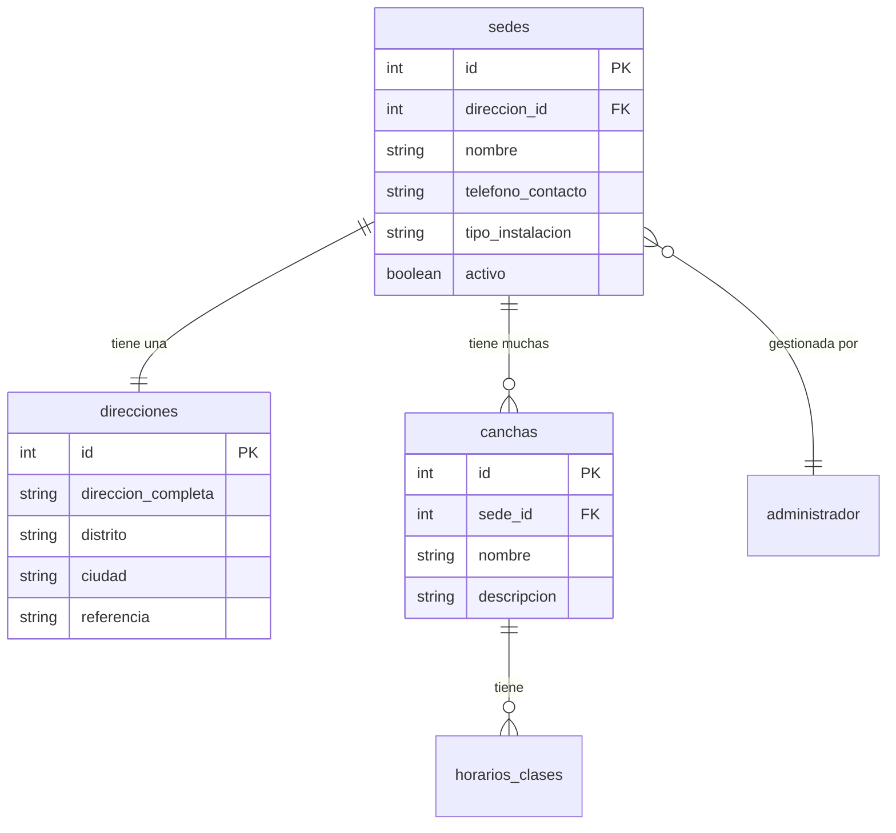
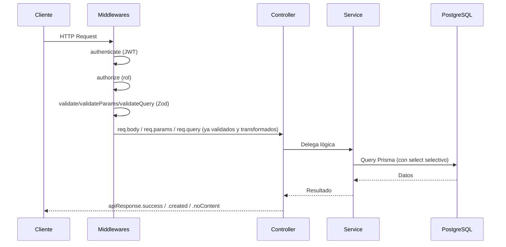
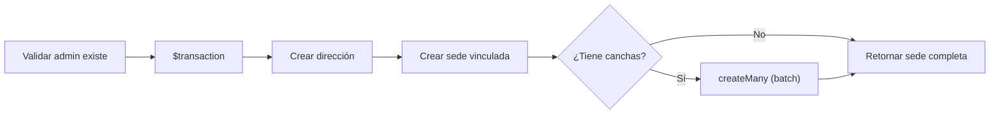
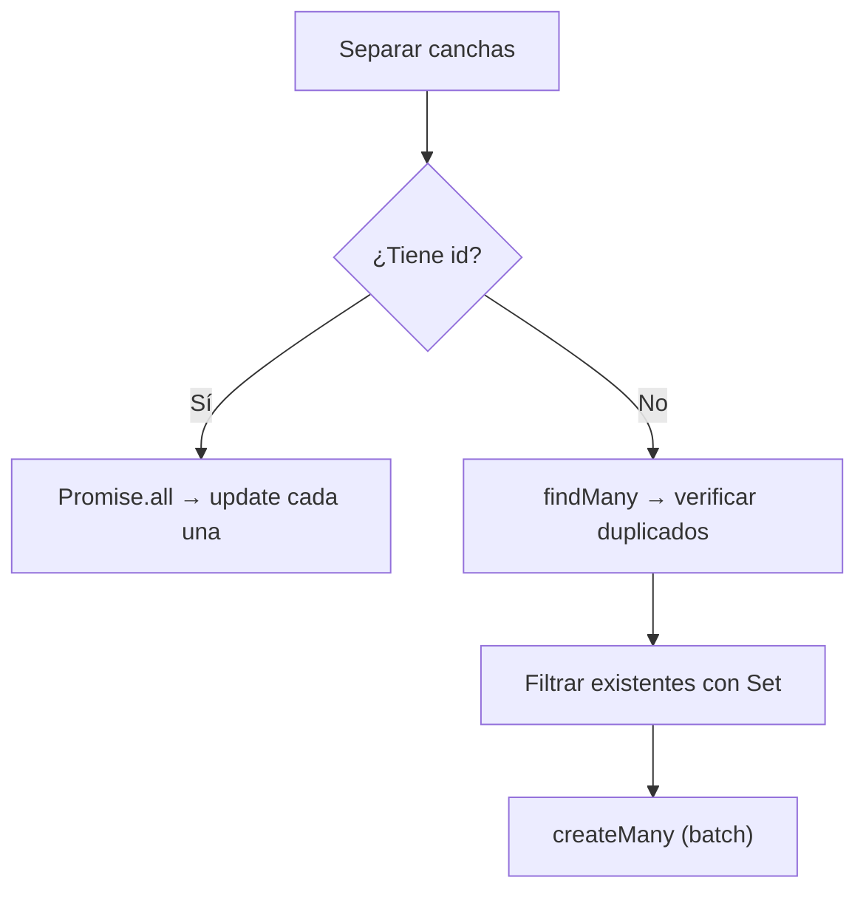

# Feature: Sedes — Documentación Técnica

Gestión completa de sedes (instalaciones físicas) de la academia, incluyendo sus direcciones, canchas y relación con administradores.

---

## Estructura de Archivos

```
src/features/sedes/
├── sede.routers.js      # Definición de endpoints y middlewares
├── sede.controller.js   # Manejo de Request/Response HTTP
├── sede.service.js      # Lógica de negocio + queries Prisma
└── sede.schema.js       # Schemas Zod para validación
```

---

## Modelo de Datos (Prisma)



---

## Endpoints

| Método | Ruta | Auth | Descripción |
|--------|------|------|-------------|
| `GET` | `/api/sedes` | No | Listar sedes con filtros y paginación |
| `GET` | `/api/sedes/canchas/conteo` | No | Listar sedes con conteo de canchas |
| `GET` | `/api/sedes/:id` | No | Obtener sede por ID (con canchas, horarios, admin) |
| `POST` | `/api/sedes` | Admin | Crear sede con dirección y canchas |
| `PUT` | `/api/sedes/:id` | Admin | Actualizar sede, dirección y canchas |
| `PATCH` | `/api/sedes/:id/desactivar` | Admin | Desactivar sede (soft delete) |
| `PATCH` | `/api/sedes/:id/activar` | Admin | Reactivar sede |
| `DELETE` | `/api/sedes/:id` | Admin | Eliminar sede + dirección + canchas |

---

## Flujo de Datos



> [!IMPORTANT]
> El controller **nunca** valida datos ni parsea params. Zod ya transforma `req.params.id` de `string` a `number` y valida `req.body` antes de llegar al controller.

---

## Archivo por Archivo

### 1. `sede.schema.js` — Validación Zod

Define **4 schemas** que actúan como guardianes antes de que la request llegue al controller:

| Schema | Uso | Qué valida |
|--------|-----|-----------|
| `createSedeSchema` | `POST /` body | `nombre` (3-100), `administrador_id` (int+), `direccion` (objeto requerido), `canchas` (array opcional) |
| `updateSedeSchema` | `PUT /:id` body | Todos opcionales, pero al menos 1 campo. `direccion` usa `.partial()` |
| `sedeIdParamSchema` | `GET/PUT/PATCH/DELETE /:id` params | Transforma `id` string → int positivo |
| `sedeQuerySchema` | `GET /` query | `activo` (bool), `distrito`, `tipo_instalacion`, `page`/`limit` (int, defaults 1/10) |

**Schemas internos reutilizados:**
- `direccionSchema` — valida `direccion_completa`, `distrito`, `ciudad` (default "Lima"), `referencia`
- `canchaSchema` — valida `nombre` (requerido) y `descripcion` (max 200, opcional)

---

### 2. `sede.controller.js` — Capa HTTP

Cada handler sigue el **patrón limpio** de Antigravity §4.1:

```javascript
handler: catchAsync(async (req, res) => {
  const resultado = await sedeService.metodo(req.params.id, req.body);
  return apiResponse.success(res, { message: '...', data: resultado });
})
```

- **`catchAsync`** envuelve cada handler, eliminando `try/catch` explícitos
- **`apiResponse.created`** (HTTP 201) para `createSede`
- **`apiResponse.noContent`** (HTTP 204) para activar/desactivar
- Los filtros de `getAllSedes` y `getCanchaForSedeCount` pasan `req.query` directamente al service (Zod ya lo validó y transformó)

---

### 3. `sede.service.js` — Lógica de Negocio

Este es el archivo más denso. Contiene la lógica central y los patrones Antigravity.

#### Constantes de Select

```javascript
const DIRECCION_SELECT = {
  select: { id: true, direccion_completa: true, distrito: true, ciudad: true, referencia: true }
};

const SEDE_SELECT_FIELDS = {
  id: true, nombre: true, telefono_contacto: true, tipo_instalacion: true, activo: true,
  direcciones: DIRECCION_SELECT,
  canchas: { select: { id, nombre, descripcion, horarios_clases: { ... } } },
  administrador: { select: { usuarios: { select: { nombres, apellidos, email, telefono } } } }
};
```

> Cumple §3.2 (Prisma Selectivo): nunca trae objetos completos de la BD.

#### `buildWhereFilters()` — Helper privado

Construye el objeto `where` de Prisma a partir de los query params. Reutilizado por `getAllSedes` y `getCanchaForSedeCount`, eliminando ~20 líneas de duplicación.

```javascript
const buildWhereFilters = ({ activo, distrito, tipo_instalacion }) => {
  const where = {};
  if (activo !== undefined) where.activo = activo;
  if (distrito) where.direcciones = { distrito: { contains: distrito, mode: 'insensitive' } };
  if (tipo_instalacion) where.tipo_instalacion = { contains: tipo_instalacion, mode: 'insensitive' };
  return where;
};
```

#### `createSede()` — Transacción multi-tabla



- Usa `prisma.$transaction` (§3.3) para atomicidad
- Las canchas se crean con `createMany` (batch, §3.1)
- Timeout de 10 segundos como protección

#### `getAllSedes()` y `getCanchaForSedeCount()`

Ambos usan:
- `buildWhereFilters()` para construir filtros
- `Promise.all([findMany, count])` para ejecutar lista + conteo en paralelo
- Paginación con `skip/take`

La diferencia: `getCanchaForSedeCount` usa `_count: { select: { canchas: true } }` y mapea el resultado a un campo `canchas_count` más legible.

#### `updateSede()` — Procesamiento paralelo de canchas

La operación más compleja del service. Dentro de una transacción:

**Paso 1:** Actualiza sede + dirección con spread condicional (`...( campo && { campo })`) para solo incluir campos presentes.

**Paso 2:** Procesa canchas en paralelo (§3.1 — Cero Bloqueo):



- **Canchas existentes** (con `id`): se actualizan en paralelo con `Promise.all`
- **Canchas nuevas** (sin `id`): un solo query para verificar duplicados (`findMany` con `IN`), luego `createMany` batch

#### `updateDefuseSede()` / `updateActiveSede()`

Operaciones simples que cambian `activo` a `false`/`true`. Retornan solo `{ id, nombre, activo, direcciones }`.

#### `deleteSede()` — Eliminación en cascada manual

Dentro de una transacción:
1. Busca el `direccion_id` de la sede
2. Elimina la sede (las canchas se eliminan por `onDelete: Cascade` en Prisma)
3. Elimina la dirección manualmente (no tiene cascade)

---

### 4. `sede.routers.js` — Definición de Rutas

La cadena de middlewares para cada ruta:

| Ruta | Cadena de Middlewares |
|------|----------------------|
| `GET /` | `validateQuery` → controller |
| `GET /:id` | `validateParams` → controller |
| `POST /` | `authenticate` → `authorize('Administrador')` → `validate` → controller |
| `PUT /:id` | `authenticate` → `authorize` → `validateParams` → `validate` → controller |
| `PATCH /:id/*` | `authenticate` → `authorize` → `validateParams` → controller |
| `DELETE /:id` | `authenticate` → `authorize` → `validateParams` → controller |

> Las rutas `GET` son públicas (sin `authenticate`). Las de escritura requieren rol **Administrador**.
