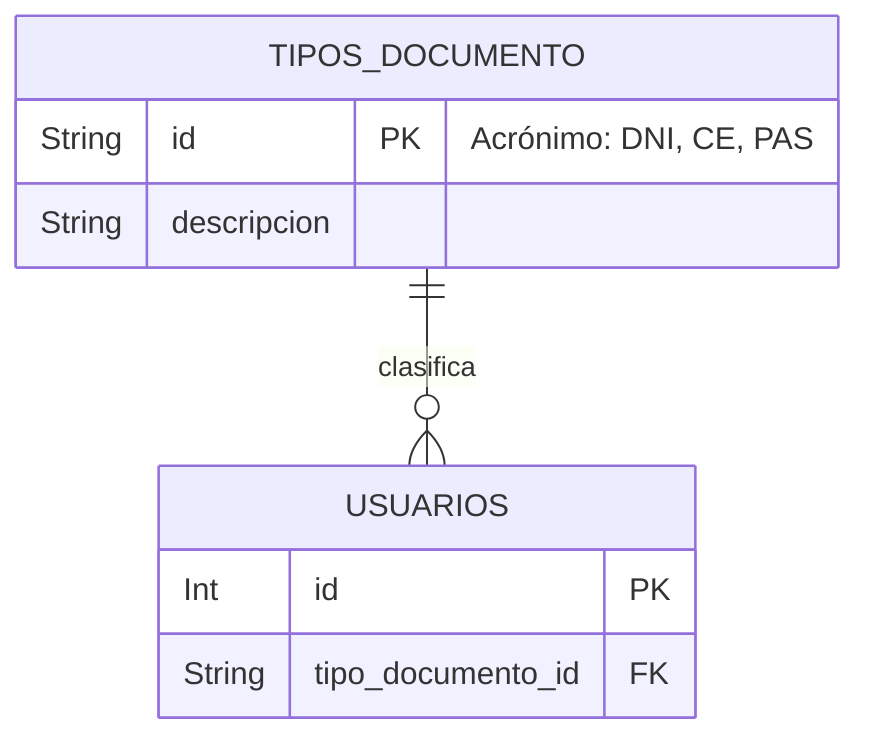

# Tipo Documento - Documentación Técnica (Antigravity 🚀)

## 1. Estructura de Archivos
Este feature gestiona el subcatálogo de identificación gubernamental (DNI, Pasaporte, CE) que el proyecto de GemaAcademy requiere para el registro formal de los usuarios.
```text
src/features/tipo_documento/
├── tipo_documento.routes.js       # Rutas (GET, POST, PUT, DELETE) (Restful, kebab-case)
├── tipo_documento.controller.js   # Interacción HTTP y apiResponse
├── tipo_documento.service.js      # Consultas directas a db e integridad de catálogo
└── tipo_documento.schema.js       # Validaciones Zod (Casteo y Sanitización)
```

## 2. Modelo de Datos


## 3. Endpoints

| Método | Endpoint | Roles Permitidos | Zod Schema | Descripción |
|---|---|---|---|---|
| GET | `/` | Público | *Ninguno* | Lista todos los tipos de documento disponibles para poblar el select de registro FrontEnd. |
| GET | `/:id` | Público | `idParamSchema` | Obtiene el detalle de un documento validando que el String `id` cumpla el Regex. |
| POST | `/` | Administrador | `createSchema` | Inserta un nuevo documento asegurando su longitud y capitalización del acrónimo. |
| PUT | `/:id` | Administrador | `updateSchema`, `idParamSchema` | Actualiza la descripción base del acrónimo mediante un Patch Lógico. |
| DELETE | `/:id` | Administrador | `idParamSchema` | Borra temporalmente, validado mediante Soft Checks del Motor. |

## 4. Cadena de Middlewares

Ejemplo del flujo de creación segura (`POST /`):
1. `authenticate`: Verifica token JWT.
2. `authorize('Administrador')`: Asegura jerarquía.
3. `validate(tipoDocumentoSchema.createSchema)`: Asegura que el *id* ("DNI") y la *descripcion* cumplan con longitud estricta antes de cargar RAM o DB.
4. `tipoDocumentosController.createTipoDocumento`: Expacha con `catchAsync`.

## 5. Schemas Zod

| Schema | Propósito | Se usa en | Uso en Middleware |
|---|---|---|---|
| `createSchema` | Forzar `.toUpperCase()` programático para la llave primaria, asegurando que si ingresan "dni", la base de datos almacene "DNI". | `POST /` | `validate` |
| `updateSchema` | Validar edición con `.optional()`. Requiere al menos que se envien campos con `refine`. | `PUT /:id` | `validate` |
| `idParamSchema` | Validación estricta que impide desbordes como `/:id/drop-table` sanitizando la URL string. | GET, PUT, DELETE | `validateParams` |

## 6. Lógica Core del Service

* **Protección de Integridad Referencial Manual:** El método `deleteTipoDocumento` previene crasheos duros 500 del motor PostgreSQL. Antes de ejecutar el `delete()` a ciegas, realiza un `count()` hacia la tabla usuarios filtrando el ID del documento en cuestión. Si se encuentra referenciado, rebota el flujo limpiamente con un `ApiError` 400 amistoso al cliente.
* **Capitalización Transaccional:** El método inserta (`idNormalizado`) el documento obligándolo a mayúsculas gracias a `.toUpperCase().trim()`.
