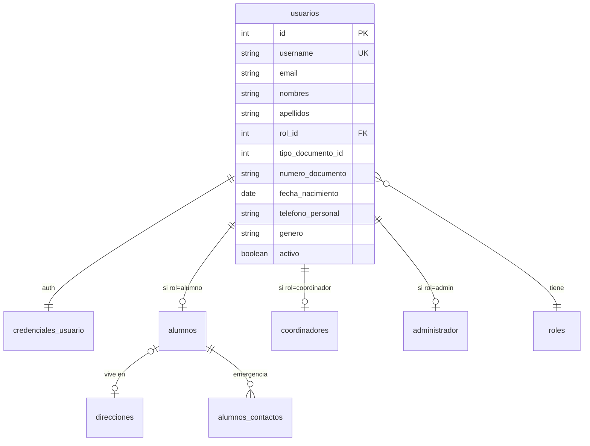
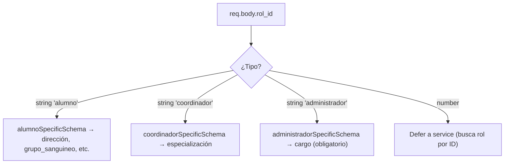
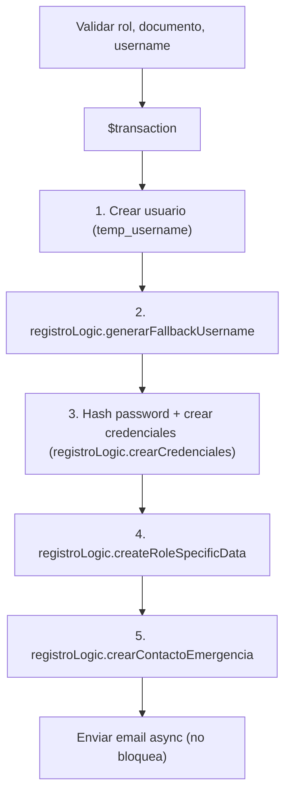

# Feature: Usuarios — Documentación Técnica

Gestión completa de usuarios del sistema: registro con datos por rol, perfil, actualización y estadísticas. Feature más complejo del proyecto por la lógica condicional de roles (Alumno, Coordinador, Administrador).

---

## Estructura de Archivos

```
src/features/usuarios/
├── usuario.routes.js              # Endpoints y middlewares
├── usuario.controller.js          # Manejo Request/Response (catchAsync)
├── usuario.service.js             # Lógica base de CRUD puro y enrutamiento hacia helpers de negocio
├── usuario.schema.js              # Archivo de re-exportación y ensamble de Schemas Zod
├── logic/
│   └── registro.logic.js          # Refactorización de partes pesadas de creaciones multi-tablas (createRoleSpecificData, etc)
├── schemas/
│   ├── common.schema.js           # Schemas comunes parametrizados
│   └── roles.schema.js            # Schemas segmentados extensivos
├── validators/
│   └── usuario.validator.js       # Validación manual de datos por rol (preview)
└── services/
    ├── dashboard.service.js       # Consultas analíticas pesadas
    ├── reporte.service.js         # Recopilación cross-relacional para Excel
    └── cumpleanos.service.js      # Cron: saludo de cumpleaños limitado por bloqueos de red (p-limit fallback)
```

---

## Modelo de Datos



---

## Endpoints

| Método | Ruta | Auth | Descripción |
|--------|------|------|-------------|
| `POST` | `/api/usuarios/register` | No | Registrar nuevo usuario (con datos por rol) |
| `POST` | `/api/usuarios/validate-role` | No | Validar datos de rol sin crear (preview) |
| `GET` | `/api/usuarios/:id` | Coord/Admin/Alumno | Obtener perfil completo |
| `GET` | `/api/usuarios/role/:rol` | No | Listar usuarios por rol |
| `GET` | `/api/usuarios/count/usuarios-stats` | No | Dashboard con conteo por rol |
| `PUT` | `/api/usuarios/:id` | Auth | Actualizar perfil de alumno |

---

## Schemas Zod (`usuario.schema.js`)

| Schema | Uso | Qué valida |
|--------|-----|-----------|
| `registerUserSchema` | `POST /register` | Datos base + `superRefine` que valida `datosRolEspecifico` según `rol_id` |
| `updateUserSchema` | `PUT /:id` | Campos opcionales: password, dirección, contacto emergencia, datos médicos |
| `idParamSchema` | `GET/PUT /:id` | Transforma `:id` string → int positivo |
| `rolParamSchema` | `GET /role/:rol` | String 1-50 chars |
| `validateRoleSchema` | `POST /validate-role` | `rol_id` (enum/int) + `datosRolEspecifico` (record) |

### `registerUserSchema` — Validación condicional por rol



---

## Service (`usuario.service.js`)

### `createUser` — Registro con Transacción



- El username se genera post-create porque usa el `id` del usuario
- El email se envía con `.catch(() => {})` para no bloquear la respuesta

### `getUserById` — Perfil selectivo

Usa `select` explícito (§3.2) con relaciones condicionales: roles, alumnos→direcciones, coordinadores, administrador→sedes. Lanza 404 si no existe.

### `updateStudentProfile` — Update multi-tabla

Transacción que puede actualizar:
- Contraseña (hash bcrypt)
- Datos médicos del alumno
- Dirección (crear o actualizar)
- Contacto de emergencia principal

### `getUsersByRol` — Búsqueda flexible

Acepta nombre de rol (case-insensitive) o ID numérico.

### Utilidades Sub-Delegadas (`logic/registro.logic.js` y `services/`)

Las analíticas de tableros fueron relegadas a `services/dashboard.service.js` para optimizarse sin empaquetar el CRUD principal, lo mismo para extracciones matriciales enviadas a `services/reporte.service.js`.

La creación multi-entidad fue refactorizada a `logic/registro.logic.js`, usando el Pattern Strategy con un mapa `{ alumno: fn, coordinador: fn, administrador: fn }` para crear los datos específicos dependiendo del rol por inyección de dependencias `tx`.

---

## Validation (`validators/usuario.validator.js`)

Módulo de validación manual usado por el endpoint `POST /validate-role` para pre-validar datos de rol sin crear el usuario. Contiene:

| Función | Uso |
|---------|-----|
| `validateRoleSpecificData` | Valida campos requeridos y específicos por rol |
| `isValidRole`, `normalizeRole` | Utilidades de normalización |
| `getBdRoleName` | Convierte rol a formato BD (PascalCase) |
| `canCreateUserRole` | Verifica permisos de creación |

---

## Cumpleaños (`services/cumpleanos.service.js`)

Cron job que:
1. Busca cumpleañeros del día con `$queryRaw` (EXTRACT month/day)
2. Envía WhatsApp (Twilio) + Email (Brevo) en paralelo con `Promise.allSettled`
3. Registra resultados con Winston logger

---

## Cadena de Middlewares

| Ruta | Cadena |
|------|--------|
| `POST /register` | `validate(registerUserSchema)` → controller |
| `POST /validate-role` | `validate(validateRoleSchema)` → controller |
| `GET /:id` | `authenticate` → `authorize('Coordinador', 'Administrador', 'Alumno')` → `validateParams` → controller |
| `GET /role/:rol` | `validateParams(rolParamSchema)` → controller |
| `GET /count/usuarios-stats` | → controller (público) |
| `PUT /:id` | `authenticate` → `validateParams` → `validate(updateUserSchema)` → controller |
